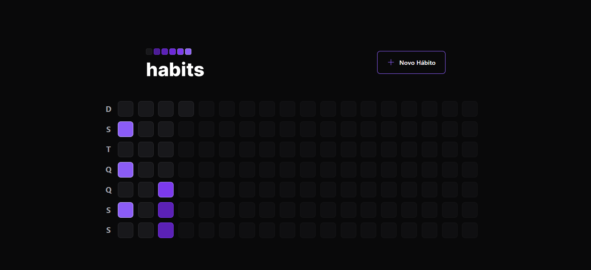
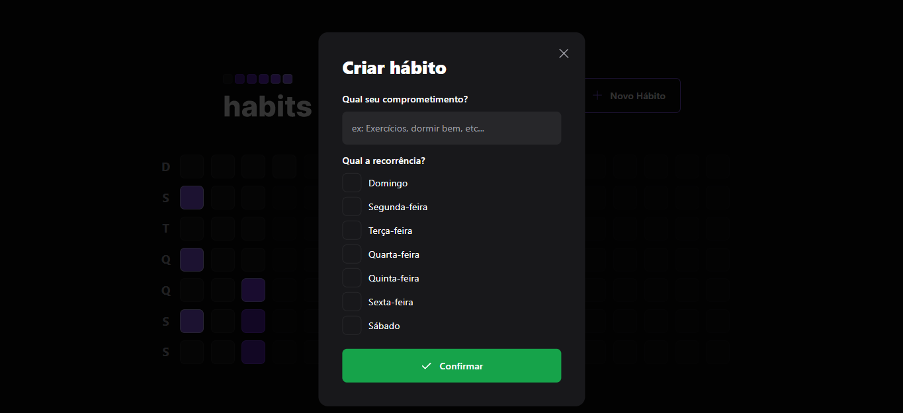
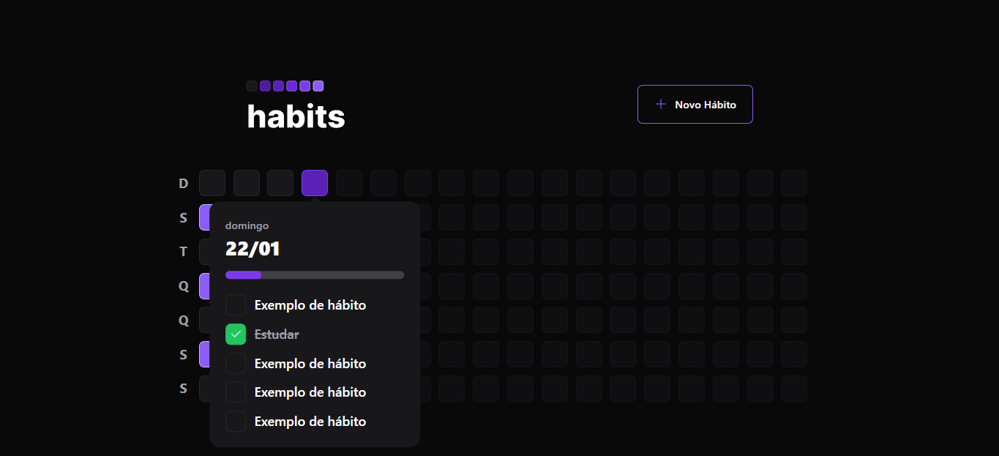

## Nlw-setup-web

**Introdução**

Esse projeto foi desenvolvido pelo time da rocketseat no programa nlw. O intuito do projeto é poder ter um local onde podemos armazenar certos hábitos e ir monitorando dia após dia, tendo a opção de poder estar sempre marcando o hábito quando concluímos.

**Funcionalidades**

As funcionalidades do front-end são:
- Criar um novo hábito
- Marcar ou desmarcar um hábito, no caso de for ou não concluído. Porém só o hábito no dia em questão.
- Componentes de modal e popover totalmente acessíveis, utilizando a biblioteca radix-ui para tornar o projeto mais acessível.

**Imagens do projeto**

Imagem da aplicação     

Modal de novo hábito     

Popover da marcação ou monitoramento dos hábitos   
